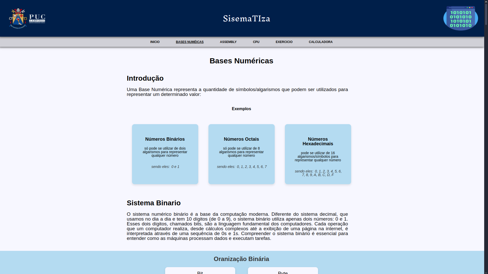
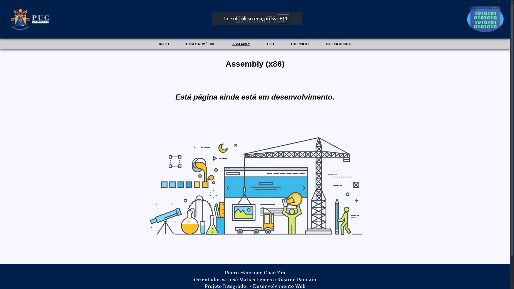
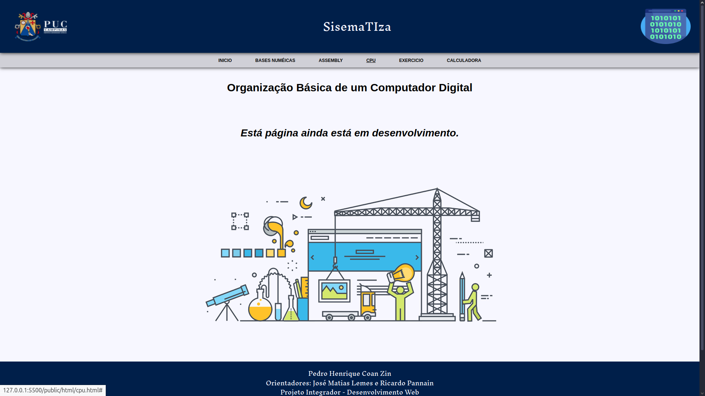
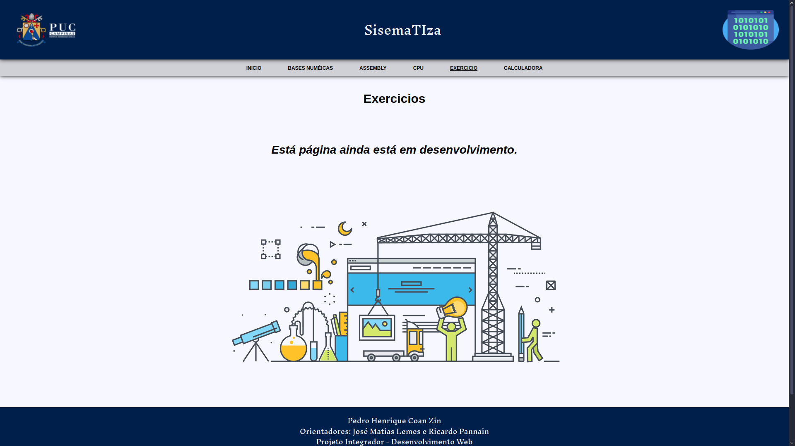
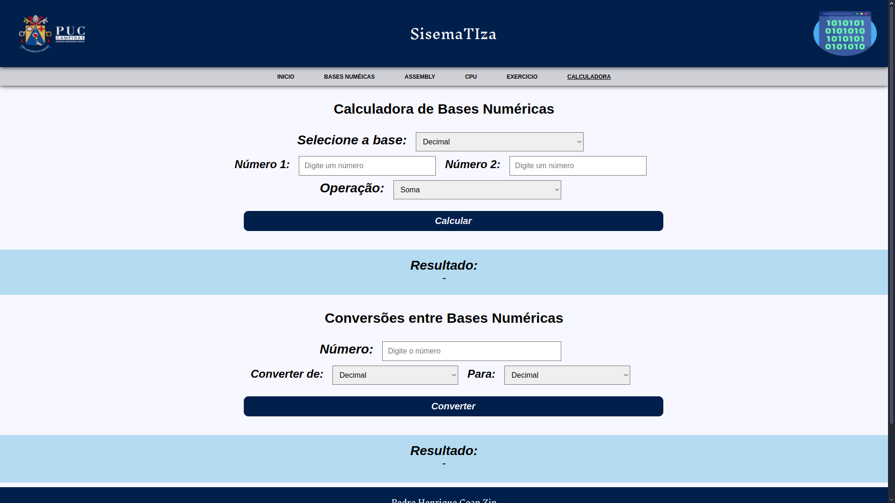
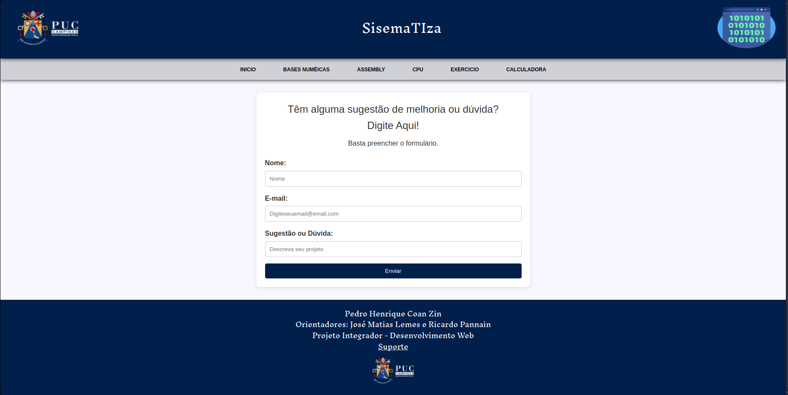

# **Site SistemaTIza**
## Aluno: Pedro Henrique Coan Zin
## Orientadores: José Matias Lemes Filho e Ricardo Pannain

## Introdução

  SistemaTIza é um projeto desenvolvido pelo aluno Pedro Henrique Coan Zin cursando a matéria de Desenvolvimento Web do segundo semestre de Engenharia da Computação na Universidade da PUC de Campinas.  
   
  O projeto tem o objetivo curricular de integrar a metéria Desenvolvimento Web, dirigida pelo professor José Matias Lemes Filho e a matéria Organização de Sistemas de Computadores, dirigida pelo professor/diretor do curso Ricardo Pannain.  
   
  A ideia do projeto consiste em criar um site web utilizando html, css, javascript e node, onde o conteúdo do site repassa o que foi aprendido na matéria de Organização de Sistemas de Computadores de forma clara, objetiva e interativa. A ideia é que alunos da universidade que passarem pelo curso e outras pessoas que buscam por esse conhecimento, tenham acesso a esse site como material de apoio para seus estudos.  

## Desenvolvimento

  ### Principal
  
    A página principal possuí em seu contaúdo uma breve introdução ao site e um texto falando sobre o projeto e montagem do site.

  ### Bases
  
    A página sobre Bases Numéricas é uma página de conteúdo informativo para estudo focada em números binários, mas que também aborda bastante os decimais e hexadecimais.

  ### Assembly
  
    A página Assembly, quando pronta, terá o objetivo de ensinar sobre a linguagem de programação assembly(x86), no momento a página ainda está em desenvolvimento.

  ### CPU
  
    A página CPU, quando pronta, terá o objetivo de ensinar sobre a organização básica de computadores, no momento a página ainda está em desenvolvimento.

  ### Exercicios
  
    A página Exercicios, quando pronta, terá o objetivo de passar alguns exercicios sobre o conteúdo de todo o site para auxilio nos estudos, no momento a página ainda está em desenvolvimento.

  ### Calculadora
  
    A página Calculadora é uma página que possuí uma calculadora programada para calcular com números binários, decimais e hexadecimais onde independente de qual a base dos seus dois números para calcular, a resposta virá nas três bases e cabe ao usuário saber qual é a resposta que ele quer, além disso ainda têm um conversor para converter números de qualquer uma dessas três bases numéricas, a calculadora Têm como objetivo servir de apoio para os estudos.

  ### Suporte
  
    O site ainda possuí uma página de suporte, que pode ser acessada pelo link no rodapé, onde possui um formulário para que o usuário possa se comunicar diretamente com o desenvolvedor para correção de bugs, atualização de conteúdo e etc.

## Apoio 

  [Figma](https://www.figma.com/design/oAWsGuzdcZCts3ZSqjN3Ku/Projeto-Integrador?node-id=1-5&m=dev&t=1XEFGNzMoneLCO9k-1) 
  https://www.figma.com/design/oAWsGuzdcZCts3ZSqjN3Ku/Projeto-Integrador?node-id=1-5&m=dev&t=1XEFGNzMoneLCO9k-1

  [Github](https://github.com/ZinPedro/SistemaTIza)
  https://github.com/ZinPedro/SistemaTIza
  
  [Trello](https://trello.com/b/OkUVAAtK/projeto-integrador-desenvolvimentowebpucc2024)
  https://trello.com/b/OkUVAAtK/projeto-integrador-desenvolvimentowebpucc2024
